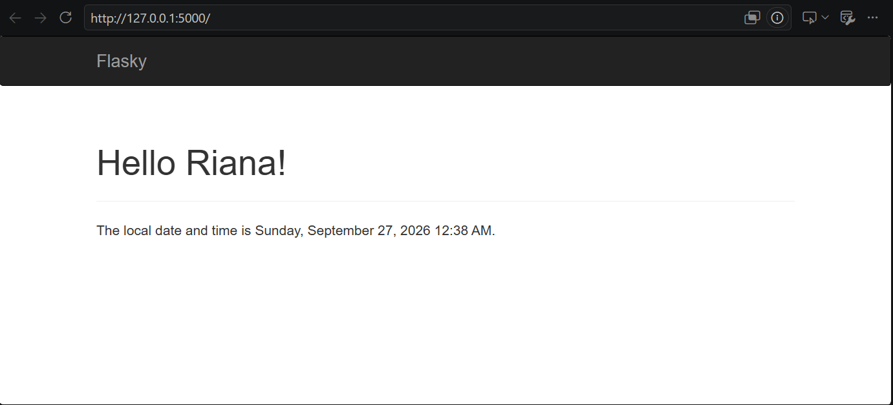

# ECE444 PRA3 - Flask and Docker

**Name:** Riana Malhotra

This repository is a clone/reproduction of the Flask examples from Miguel Grinberg's Flasky repository:
https://github.com/miguelgrinberg/flasky

## Activity 1.3 - Chapter 3

The following screenshot demonstrates the Chapter 3 Flask application with a navigation bar, personalized greeting, and local timestamp.

